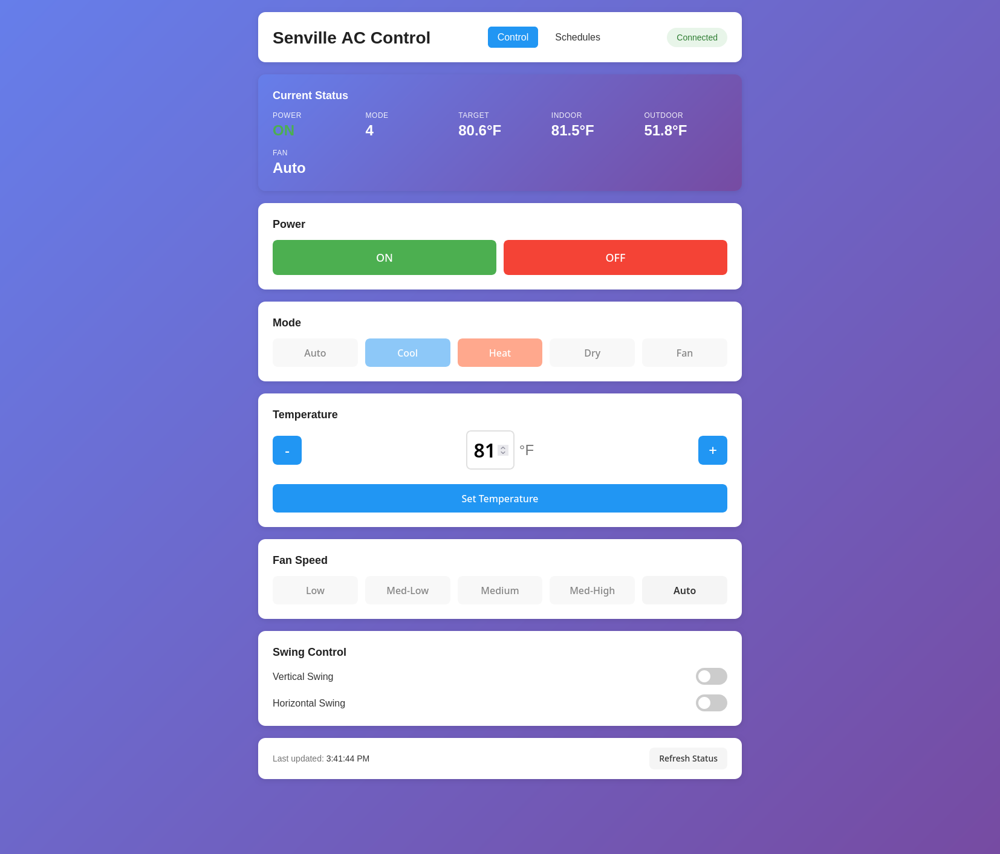

# Senville/Midea Mini-Split Reverse Engineering & Control

Complete toolkit for local control of Senville/Midea mini-split air conditioners with web interface, scheduling, and reverse engineering tools.
I have a Senville mini-split HVAC unit (a rebadged Midea) with a WiFi controller. I have been using the supplied Android/cloud based utility to control it. I have wanted to reverse engineer the protocol to eliminate the reliance on a third party. I have been exploringing AI and have found Claude to be the most effective cli AI for me so I asked it to help me reverse engineer the Senville. It quickly reveled that the Senville was a rebadged Midea and that there was a considerable amount if information online. Claude quickly took over the job of reverse engineering and developing a number of tools. This repo is the result. This repo does contains utilities to monitor and control a Senville but is not what I would call polished product.

## Features

✅ **Local Control** - No cloud required, direct communication with your AC
✅ **Desktop GUI** - Native graphical interface with real-time status updates
✅ **Web Dashboard** - Modern web interface with REST API (http://localhost:5000)
✅ **Scheduling** - Automated temperature/mode changes with background daemon
✅ **Command-Line Tools** - Python scripts for all AC functions
✅ **Protocol Analysis** - WiFi capture and reverse engineering tools
✅ **Multiple Units** - Compatible with many Midea-based brands

## Quick Start

### 1. Clone and Setup

```bash
# Clone the repository
git clone https://github.com/YOUR_USERNAME/senville-control.git
cd senville-control

# Create Python virtual environment
python3 -m venv venv
source venv/bin/activate

# Install dependencies
pip install midea-beautiful-air msmart-ng python-dotenv flask
```

### 2. Discover Your Device

```bash
source venv/bin/activate

# Option 1: Local discovery (no account needed)
python3 discover.py YOUR_AC_IP_ADDRESS

# Option 2: Cloud discovery (requires Midea/SmartLife account)
python3 discover.py --account YOUR_EMAIL --password YOUR_PASSWORD
```

This outputs your device credentials:
- `SENVILLE_IP` - Device IP address
- `SENVILLE_DEVICE_ID` - Device ID
- `SENVILLE_TOKEN` - 128-character authentication token
- `SENVILLE_KEY` - 64-character encryption key

### 3. Configure Environment

```bash
# Copy the example configuration
cp .env.example .env

# Edit .env with your device credentials from step 2
nano .env
```

Required variables in `.env`:
```bash
SENVILLE_IP=192.168.1.XXX
SENVILLE_TOKEN=your_128_char_token_here
SENVILLE_KEY=your_64_char_key_here
```

Optional variables:
```bash
SENVILLE_DEVICE_ID=your_device_id
SENVILLE_MAC=XX:XX:XX:XX:XX:XX
NETWORK_INTERFACE=eth0        # For packet capture
PHONE_IP=192.168.1.50         # For packet capture
```

### 4. Generate Personalized Docs (Optional)

```bash
# Generate local documentation with your real IP addresses
./generate_local.sh

# Read your personalized docs (gitignored, safe)
cat PROJECT_NOTES.local.md
cat QUICK_REFERENCE.local.md
```

This creates `*.local.md` files with your actual device info for easy reference.

### 5. Test Connection

```bash
source venv/bin/activate

# Quick connectivity test
./troubleshoot.sh

# Check AC status
python3 status.py
```

### 6. Control Your AC

**Command Line:**
```bash
# Turn on heat mode at 72°F
python3 control_simple.py --power on --mode heat --temp-f 72

# Turn off
python3 control_simple.py --power off

# Full control with fan and swing
python3 control_full.py --power on --mode cool --temp-f 68 --fan-speed 60 --vswing on
```

**Desktop GUI:**
```bash
# Start the graphical interface
./start_gui.sh

# Native desktop app with real-time status and controls
# No browser needed, uses Python tkinter
```

**Web Interface:**



```bash
# Start the web server
./start_web.sh

# Open in browser
http://localhost:5000              # Control dashboard
http://localhost:5000/schedules.html   # Scheduling interface
```

**REST API:**
```bash
# Get status
curl http://localhost:5000/api/status

# Turn on
curl -X POST http://localhost:5000/api/power/on

# Set temperature
curl -X POST http://localhost:5000/api/temperature/72
```

---

## Documentation

📖 **User Guides:**
- `README_SETUP.md` - Detailed setup instructions
- `QUICK_REFERENCE.md` - Quick command reference (template)
- `QUICK_REFERENCE.local.md` - Your personalized reference (generated)

🖥️ **Interfaces:**
- `GUI_INTERFACE.md` - Desktop GUI application
- `WEB_INTERFACE.md` - Web dashboard and REST API documentation
- `AUTOMATION.md` - Scheduling and automation guide

🔧 **Technical:**
- `senville-protocol-documentation.md` - Protocol specifications
- `senville-control-guide.md` - Detailed usage guide
- `RELIABILITY_IMPROVEMENTS.md` - Performance optimizations
- `PROJECT_NOTES.md` - Development notes (template)

---

## Scheduling & Automation

Create automated temperature schedules:

**Via Web Interface:**
```
http://localhost:5000/schedules.html
```

**Via Command Line:**
```bash
# Morning warmup at 7 AM
python3 manage_schedules.py add "Morning Heat" "07:00" --power on --mode heat --temp-f 68

# Turn off at night
python3 manage_schedules.py add "Night Off" "23:00" --power off

# Start the scheduler daemon
python3 scheduler.py --daemon
```

See `AUTOMATION.md` for complete documentation.

---

## Installation as System Services

Run the web server and scheduler automatically on boot:

```bash
# Install systemd services
sudo ./install_services.sh

# Start services
sudo systemctl start senville-api
sudo systemctl start senville-scheduler

# Enable auto-start on boot
sudo systemctl enable senville-api
sudo systemctl enable senville-scheduler
```

---

## Template-Based Documentation

This repository uses environment variables to keep sensitive data out of git:

**Template files (in git):**
- Use `${VARIABLE_NAME}` placeholders
- Safe to commit publicly
- Example: `PROJECT_NOTES.md`

**Generated files (local only):**
- Created by `./generate_local.sh`
- Contain your real IP addresses
- Automatically gitignored
- Example: `PROJECT_NOTES.local.md`

When you clone this repo, run `./generate_local.sh` to create your personalized documentation.

---

## Reverse Engineering Tools

For deeper protocol analysis and packet capture:

### WiFi Packet Capture

**Prerequisites:**
- Wireless adapter with monitor mode support
- aircrack-ng suite: `sudo apt install aircrack-ng`
- tcpdump: `sudo apt install tcpdump`

**Capture traffic:**
```bash
# Edit .env with your NETWORK_INTERFACE
nano .env

# Capture all AC traffic
./capture_all_ac_traffic.sh

# Capture phone-to-AC traffic
./capture_phone_to_ac.sh
```

**Analyze captures:**
```bash
source venv/bin/activate
python3 analyze_capture.py capture_file.pcap
```

See `senville-protocol-documentation.md` for protocol details.

---

## Project Structure

```
senville-control/
├── .env                    # Your configuration (gitignored)
├── .env.example            # Configuration template
├── README.md               # This file
├── README_SETUP.md         # Detailed setup guide
│
├── Python Scripts
│   ├── discover.py         # Device discovery
│   ├── status.py           # Check AC status
│   ├── control_simple.py   # Basic control
│   ├── control_full.py     # Full control (fan/swing)
│   ├── api_server.py       # Web server & REST API
│   ├── scheduler.py        # Scheduling daemon
│   └── manage_schedules.py # Schedule management CLI
│
├── Shell Scripts
│   ├── generate_local.sh   # Generate personalized docs
│   ├── start_gui.sh        # Start desktop GUI
│   ├── start_web.sh        # Start web interface
│   ├── troubleshoot.sh     # Connection diagnostics
│   └── capture_*.sh        # Packet capture scripts
│
├── Web Interface
│   └── web/
│       ├── index.html      # Control dashboard
│       ├── schedules.html  # Scheduling UI
│       └── *.js, *.css     # Frontend code
│
├── Documentation
│   ├── *.md                # Template docs (${VARIABLES})
│   └── *.local.md          # Your personalized docs (generated)
│
└── System Services
    ├── senville-api.service       # Web server service
    └── senville-scheduler.service # Scheduler service
```

---

## Security

### Safe to Commit
- ✅ Template files with `${VARIABLE}` syntax
- ✅ `.env.example`
- ✅ Scripts that read from `.env`
- ✅ Documentation templates

### Never Commit (Protected by .gitignore)
- ❌ `.env` - Contains credentials
- ❌ `*.local.md` - Contains your IP addresses
- ❌ `*.pcap` - Packet captures
- ❌ `*.pid` - Runtime files
- ❌ `schedules.json` - Your schedules

### Best Practices
- Use DHCP reservation for your AC's IP address
- Keep your `.env` file secure
- Don't share your token/key publicly
- Tokens may expire - rediscover if connection fails

---

## Troubleshooting

### Device Not Found
```bash
# Test connectivity
ping YOUR_AC_IP

# Run diagnostics
./troubleshoot.sh

# Try cloud discovery
python3 discover.py --account EMAIL --password PASS
```

### Connection Errors
```bash
# Verify .env configuration
cat .env

# Rediscover device (tokens may expire)
python3 discover.py YOUR_AC_IP

# Update .env with new token/key
```

### Web Interface Issues
```bash
# Check if port 5000 is available
sudo lsof -i :5000

# View logs
tail -f /tmp/senville-api.log  # If running as service

# Restart web server
./restart_web.sh
```

See `README_SETUP.md` for detailed troubleshooting.

---

## Compatibility

**Tested Devices:**
- Senville SENL Series with OSK105 WiFi adapter
- Midea mini-splits with V3 protocol

**Should Work With:**
Klimaire, AirCon, Century, Pridiom, Thermocore, Comfee, Toshiba, Carrier, Goodman, Friedrich, Samsung (Midea-based), Kenmore, Trane, Lennox, LG (Midea-based), Electrolux, Qlima, Artel, Inventor, Dimstal/Simando, Pioneer

**Requirements:**
- Python 3.8+
- Linux (Debian/Ubuntu tested, should work on macOS)
- Device on same network

**WiFi Capture (Optional):**
- Wireless adapter with monitor mode
- aircrack-ng suite

---

## Protocol Overview

### Network Communication
- **TCP Port 6444** - Encrypted commands
- **UDP Port 6445** - Device discovery
- **Authentication** - V3 protocol with token/key

### UART Interface
- **Baud Rate:** 9600 8N1
- **WiFi Module:** OSK103/OSK105
- **Direct Control:** Bypasses WiFi module

### Supported Features
- Power on/off
- Temperature: 16-31°C (60-87°F)
- Modes: Cool, Heat, Auto, Dry, Fan
- Fan speeds: 5 levels + auto
- Swing: Vertical and horizontal
- Eco/Turbo modes (device-dependent)

See `senville-protocol-documentation.md` for complete protocol details.

---

## Resources

### Related Projects
- [nbogojevic/midea-beautiful-air](https://github.com/nbogojevic/midea-beautiful-air) - Python control library (used by this project)
- [mac-zhou/midea-ac-py](https://github.com/mac-zhou/midea-ac-py) - Home Assistant integration
- [dudanov/MideaUART](https://github.com/dudanov/MideaUART) - Arduino UART library
- [reneklootwijk/node-mideahvac](https://github.com/reneklootwijk/node-mideahvac) - Node.js implementation

### Documentation
- Official Midea protocol is not publicly documented
- This project uses reverse engineering and open-source libraries
- Community contributions welcome!

---

## Contributing

Contributions welcome! Areas of interest:
- Additional protocol features (eco mode, turbo, sleep timers)
- Support for other Midea device types (dehumidifiers, etc.)
- Home Assistant integration improvements
- Mobile app development
- Additional brand testing

Please open issues or pull requests on GitHub.

---

## License

Educational and research use. This project is for controlling devices you own. Respect manufacturer's terms of service and local laws regarding reverse engineering.

---

## Credits

- Reverse engineering based on open-source Midea protocol projects
- Built using `midea-beautiful-air` and `msmart-ng` libraries
- Protocol documentation from community research

---

**Created:** 2025-10-30
**Last Updated:** 2025-11-01
**Status:** Fully functional - local control, web interface, scheduling, and reverse engineering tools ready

---

## Quick Links

- **Setup Guide:** `README_SETUP.md`
- **Quick Reference:** Run `./generate_local.sh` then see `QUICK_REFERENCE.local.md`
- **Desktop GUI:** Run `./start_gui.sh` - Native desktop application
- **Web Interface:** `http://localhost:5000` (after running `./start_web.sh`)
- **Scheduling:** `AUTOMATION.md`
- **GUI Documentation:** `GUI_INTERFACE.md`
- **API Documentation:** `WEB_INTERFACE.md`
- **Protocol Details:** `senville-protocol-documentation.md`
